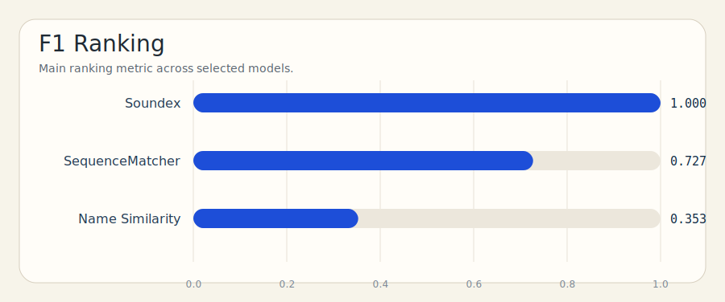
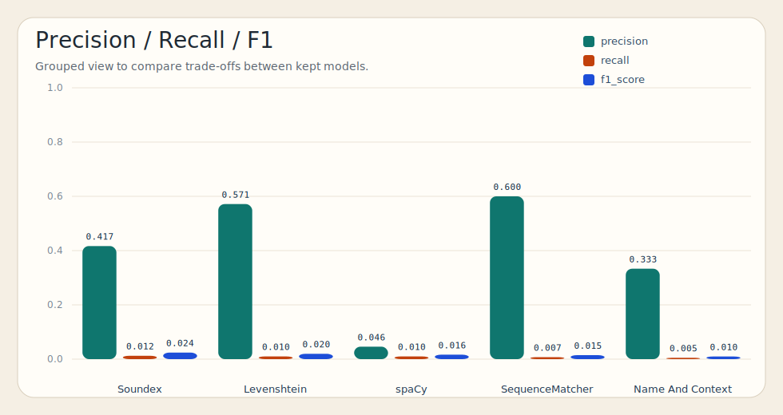

<div align="center">

<br/>

# 🔤 NLP · Noms & Prénoms

### Regroupement de variantes, résumé automatique et exploration de noms propres<br/>par similarité phonétique et sémantique.

<br/>

[](https://python.org)
[](https://streamlit.io)
[](https://spacy.io)
[](https://en.wikipedia.org/wiki/Soundex)
[](https://en.wikipedia.org/wiki/ROUGE_(metric))

<br/>

> Données brutes → nettoyage → regroupement → fusion → résumés → interface interactive.

<br/>

</div>

---

## 🗺️ Table des matières

- [Objectif](#-objectif)
- [Architecture](#-architecture)
- [Nettoyage NLP](#-nettoyage-nlp)
- [Pipeline — Noms de famille](#-pipeline--noms-de-famille)
- [Pipeline — Prénoms](#-pipeline--prénoms)
- [Modèles de regroupement](#-modèles-de-regroupement)
- [Génération de résumés](#-génération-de-résumés)
- [Évaluation](#-évaluation)
- [Fichiers clés](#-fichiers-clés)
- [Commandes](#-commandes)

---

## 🎯 Objectif

Ce projet NLP construit un pipeline complet autour des noms propres :

| Étape | Description |
|---|---|
| 🧹 **Nettoyage** | Normalisation des noms — accents, casse, caractères spéciaux |
| 🔗 **Regroupement** | Détection automatique des variantes d'un même nom |
| 📄 **Fusion** | Agrégation des textes d'origine au sein de chaque groupe |
| 🤖 **Résumé** | Génération automatique d'un résumé par groupe |
| 🔍 **Exploration** | Interface Streamlit pour rechercher et visualiser les résultats |

> **Modèle principal retenu : `approach_5_soundex`** — deux noms phonétiquement proches sont regroupés ensemble, ce qui est particulièrement adapté aux variantes régionales et historiques.

---

## 🏗️ Architecture

```
projet-nlp/
│
├── data/                            # Données brutes d'entrée
│   ├── names.json
│   └── origins.json
│
├── code/                            # ⭐ Cœur du pipeline noms de famille
│   └── main.py                      # Nettoyage → regroupement → résumés
│
├── src/                             # Scripts complémentaires
│   ├── run_all.py                   # Lance le pipeline global
│   ├── scrape_firstname_list.py     # Scrape la liste des prénoms
│   ├── scrape_firstname_details.py  # Scrape les détails par prénom
│   ├── summarize_firstnames.py      # Résumés des prénoms
│   ├── group_firstnames_soundex.py  # Regroupement phonétique
│   ├── compare_summarizers.py       # Comparaison des modèles de résumé
│   └── evaluate_summaries.py        # Évaluation ROUGE
│
├── outputs/                         # Sorties détaillées par modèle
│   └── 05_soundex/
│       ├── final_dataset_soundex.json
│       ├── merged_groups_soundex.json
│       └── group_summaries_soundex.json
│
├── results/                         # ✅ Fichiers finaux lus par l'app
│   ├── final_dataset.json
│   ├── merged_groups.json
│   ├── group_summaries.json
│   ├── firstnames_dataset.json
│   └── firstnames_group_summaries_soundex.json
│
├── app/                             # Interface utilisateur
│   └── streamlit_app.py
│
└── test/                            # Comparaison et évaluation des modèles
    ├── run_test_approaches.py
    ├── compare_test_metrics.py
    └── data/
        ├── test_data.json
        └── gold_clusters.template.json
```

---

## 🧹 Nettoyage NLP

Avant toute comparaison, les noms passent par un nettoyage pour garantir la cohérence des données :

```
"Vilanová"   ──►  vilanova
"Mañalich"   ──►  manalich
"  Dupont "  ──►  dupont
```

Opérations appliquées :

- Passage en **minuscules**
- Suppression des **accents**
- Retrait des **caractères spéciaux**
- Élimination des **espaces superflus**
- Construction d'une **forme normalisée** du nom

> Sans ce nettoyage, `Vilanová` et `vilanova` seraient traités comme deux noms distincts alors qu'ils représentent la même variante.

---

## 🔄 Pipeline — Noms de famille

```
┌──────────────────────────────────────┐
│  data/names.json                     │
│  data/origins.json                   │
└─────────────────┬────────────────────┘
                  │
                  ▼
┌──────────────────────────────────────┐
│  code/main.py                        │
│                                      │
│  ① Chargement des données            │
│  ② Normalisation des noms            │
│  ③ Comparaison par paires            │
│  ④ Création des groupes de variantes │
│  ⑤ Fusion des textes par groupe      │
│  ⑥ Génération des résumés            │
└─────────────────┬────────────────────┘
                  │
                  ▼
┌──────────────────────────────────────┐
│  outputs/05_soundex/                 │
│  ├── final_dataset_soundex.json      │
│  ├── merged_groups_soundex.json      │
│  └── group_summaries_soundex.json    │
└─────────────────┬────────────────────┘
                  │
                  ▼
┌──────────────────────────────────────┐
│  results/   (fichiers finaux)        │
└─────────────────┬────────────────────┘
                  │
                  ▼
┌──────────────────────────────────────┐
│  app/streamlit_app.py   🖥️           │
└──────────────────────────────────────┘
```

---

## 🔄 Pipeline — Prénoms

```
scrape_firstname_list.py
         │
         ▼
 firstnames_list.json
         │
         ▼
scrape_firstname_details.py
         │
         ▼
 firstnames_dataset.json
         │
         ▼
 summarize_firstnames.py
         │
         ▼
group_firstnames_soundex.py
         │
         ▼
 firstnames_grouped_soundex.json
         │
         ▼
 firstnames_group_summaries_soundex.json
         │
         ▼
 app/streamlit_app.py   🖥️
```

---

## 🧪 Modèles de regroupement

Cinq approches ont été comparées. Le principe est toujours le même : comparer deux noms, mesurer leur proximité, les regrouper s'ils semblent représenter la même variante.

| # | Modèle | Signal utilisé | Principe |
|---|---|---|---|
| 1 | **Name + Context** | Nom + texte descriptif | Similarité sémantique enrichie du contexte |
| 2 | **Sequence Matcher** | Chaîne de caractères | Ressemblance visuelle caractère par caractère |
| 3 | **Levenshtein** | Chaîne de caractères | Nombre de modifications pour passer d'un nom à l'autre |
| 4 | **Soundex** ⭐ | Prononciation | Regroupement phonétique approximatif |
| 5 | **spaCy** | Nom + contexte | Similarité vectorielle |

---

## 📝 Génération de résumés

### Noms de famille

Le résumé est construit à partir des **textes fusionnés** du groupe. Les phrases les plus représentatives sont sélectionnées.

### Prénoms

Le résumé est généré à partir des informations scrapées : **origine**, **signification**, **description**.

### Comparaison des modèles de résumé (`compare_summarizers.py`)

| Modèle | Type | Approche |
|---|---|---|
| **TF-IDF + mots-clés** | Extractif | Sélection par fréquence des termes |
| **TextRank** | Extractif | Graphe de similarité entre phrases |
| **DistilBART** | Abstractif | Génération — reformule le contenu |

---

## 📊 Évaluation

### Regroupement — `test/`

Les groupes prédits sont comparés au fichier de référence `gold_clusters.template.json` :

| Métrique | Description |
|---|---|
| **Precision** | Proportion de paires correctement regroupées |
| **Recall** | Proportion de vraies variantes retrouvées |
| **F1-score** | Moyenne harmonique précision / rappel |

### Résumés — `evaluate_summaries.py`

```
ROUGE-1  →  chevauchement des unigrammes
ROUGE-2  →  chevauchement des bigrammes
ROUGE-L  →  plus longue sous-séquence commune
```

### Visualisations

Les graphiques ci-dessous sont générés par `test/compare_test_metrics.py` :

**Classement par F1-score**


**Comparaison précision / rappel / F1**


---

## 🗂️ Fichiers clés

| Fichier | Rôle |
|---|---|
| `code/main.py` | ⭐ Cœur du regroupement des noms de famille |
| `src/run_all.py` | Lance le pipeline complet en une commande |
| `src/group_firstnames_soundex.py` | Regroupement phonétique des prénoms |
| `app/streamlit_app.py` | Interface finale de présentation |
| `test/run_test_approaches.py` | Exécution des modèles de test |
| `test/compare_test_metrics.py` | Comparaison et visualisation des métriques |

---

## ⚡ Commandes

### Installation

```powershell
python -m venv venv
.\venv\Scripts\activate
python -m pip install -r requirements.txt
```

### Lancer le pipeline complet

```powershell
.\venv\Scripts\python.exe src\run_all.py
```

### Lancer l'application Streamlit

```powershell
.\venv\Scripts\python.exe -m streamlit run app\streamlit_app.py
```

### Lancer les tests et la comparaison des modèles

```powershell
# Exécuter les approches de regroupement
.\venv\Scripts\python.exe test\run_test_approaches.py

# Comparer et visualiser les métriques
.\venv\Scripts\python.exe test\compare_test_metrics.py
```

---

<div align="center">

<br/>

**Projet NLP · Noms & Prénoms** · Soundex · TextRank · DistilBART · ROUGE

<br/>

*Projet académique — pipeline de regroupement et résumé automatique de noms propres.*

</div>