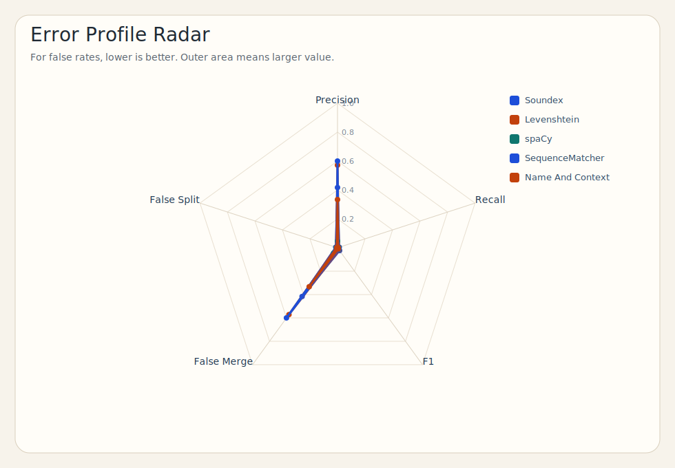

# Projet NLP sur les noms de famille et les prenoms

## 1. Objectif du projet

Ce projet a pour objectif de construire une application capable de :

- regrouper les variantes de noms de famille
- fusionner les textes d'origine associes a ces noms
- generer des resumes automatiques
- scraper et analyser des prenoms
- afficher les resultats dans une application Streamlit

L'idee generale est simple :

1. on part des donnees brutes
2. on nettoie les noms
3. on regroupe les variantes
4. on fusionne les textes
5. on genere des resumes
6. on affiche tout dans une interface

---

## 2. Architecture generale

Le projet est organise en plusieurs parties :

- `data/` : les donnees d'entree
- `code/` : le pipeline principal pour les noms de famille
- `src/` : les scripts complementaires
- `outputs/` : les sorties detaillees par modele
- `results/` : les fichiers finaux lus par l'application
- `app/` : l'application Streamlit
- `test/` : les scripts de comparaison des modeles

Structure simplifiee :

```text
data/      -> donnees d'entree
code/      -> regroupement principal des noms
src/       -> scripts complementaires
outputs/   -> sorties detaillees
results/   -> sorties finales pour l'application
app/       -> interface utilisateur
test/      -> evaluation des modeles
```

---

## 3. Nettoyage NLP

Avant de comparer les noms, le projet applique un nettoyage simple pour rendre les donnees plus coherentes.

Les principales etapes sont :

- passer les noms en minuscules
- supprimer les accents
- enlever les caracteres speciaux inutiles
- supprimer les espaces en trop
- construire une forme normalisee du nom

Exemples :

- `Vilanová` devient `vilanova`
- `Mañalich` devient `manalich`

Ce nettoyage evite qu'un meme nom soit traite comme deux noms differents uniquement a cause de la casse, des accents ou d'une petite difference d'ecriture.

---

## 4. Role de chaque dossier

### `data/`

Ce dossier contient les donnees de depart.

Fichiers principaux :

- `data/names.json`
- `data/origins.json`

### `code/`

Ce dossier contient le coeur du travail sur les noms de famille.

Fichier principal :

- `code/main.py`

Ce script :

- charge les donnees
- nettoie les noms
- applique le regroupement
- cree les groupes de variantes
- fusionne les textes
- genere les resumes de groupes

### `src/`

Ce dossier contient les scripts complementaires.

Exemples :

- `src/run_all.py` : lance le pipeline global
- `src/scrape_firstname_list.py` : scrape la liste des prenoms
- `src/scrape_firstname_details.py` : scrape les details des prenoms
- `src/summarize_firstnames.py` : genere des resumes simples pour les prenoms
- `src/group_firstnames_soundex.py` : regroupe les prenoms avec Soundex
- `src/compare_summarizers.py` : compare plusieurs modeles de resume
- `src/evaluate_summaries.py` : evalue les resumes

### `outputs/`

Ce dossier contient les sorties detaillees de chaque approche.

Exemple pour Soundex :

- `outputs/05_soundex/final_dataset_soundex.json`
- `outputs/05_soundex/merged_groups_soundex.json`
- `outputs/05_soundex/group_summaries_soundex.json`

### `results/`

Ce dossier contient les fichiers finaux utilises par l'application.

Exemples :

- `results/final_dataset.json`
- `results/merged_groups.json`
- `results/group_summaries.json`
- `results/firstnames_dataset.json`
- `results/firstnames_group_summaries_soundex.json`

### `app/`

Ce dossier contient l'application finale.

Fichier principal :

- `app/streamlit_app.py`

### `test/`

Ce dossier sert a comparer les modeles de regroupement.

Fichiers principaux :

- `test/run_test_approaches.py`
- `test/compare_test_metrics.py`
- `test/data/test_data.json`
- `test/data/gold_clusters.template.json`

---

## 5. Pipeline des noms de famille

Le pipeline des noms de famille est le coeur du projet.

Etapes :

1. charger les noms et les textes d'origine
2. nettoyer et normaliser les noms
3. comparer les noms entre eux
4. creer des groupes de variantes
5. fusionner les textes d'un meme groupe
6. generer un resume pour chaque groupe

Schema simple :

```text
data/names.json + data/origins.json
            ->
        code/main.py
            ->
outputs/05_soundex/final_dataset_soundex.json
            ->
outputs/05_soundex/merged_groups_soundex.json
            ->
outputs/05_soundex/group_summaries_soundex.json
            ->
results/
            ->
app/streamlit_app.py
```

Le modele principal retenu pour les noms de famille est :

- `approach_5_soundex`

---

## 6. Pipeline des prenoms

Pour les prenoms, le projet suit une logique de scraping puis de regroupement.

Etapes :

1. scraper une liste de prenoms
2. scraper les details de chaque prenom
3. structurer les informations
4. generer des resumes
5. regrouper les prenoms avec Soundex
6. afficher les groupes dans l'application

Schema simple :

```text
scrape_firstname_list.py
        ->
firstnames_list.json
        ->
scrape_firstname_details.py
        ->
firstnames_dataset.json
        ->
group_firstnames_soundex.py
        ->
firstnames_grouped_soundex.json
        ->
firstnames_group_summaries_soundex.json
        ->
app/streamlit_app.py
```

---

## 7. Modeles de regroupement

Le principe commun des modeles compares est simple :

- comparer deux noms
- mesurer leur proximite
- les mettre dans le meme groupe s'ils semblent representer la meme variante

### 1. Name and Context

- compare le nom
- utilise aussi le texte descriptif associe

### 2. Sequence Matcher

- compare directement les caracteres des deux noms
- mesure leur ressemblance visuelle

### 3. Levenshtein

- calcule le nombre de modifications necessaires pour passer d'un nom a l'autre

### 4. Soundex

- compare la prononciation approximative des noms
- deux noms proches phonetiquement peuvent etre regroupes

C'est le modele principal choisi dans ce projet.

### 5. spaCy

- utilise une similarite vectorielle sur le nom et son contexte

---

## 8. Generation des resumes

### Pour les noms de famille

Le resume est construit a partir des textes fusionnes d'un groupe.

### Pour les prenoms

Le resume est genere a partir des informations scrapees :

- origine
- signification
- description

### Modeles de resume compares

Dans `src/compare_summarizers.py`, trois approches sont comparees :

- TF-IDF + mots-cles
- TextRank
- DistilBART

---

## 9. Evaluation

Le projet contient deux types d'evaluation.

### Evaluation des modeles de regroupement

Elle est faite dans le dossier `test/`.

On compare les groupes predits avec un fichier de reference :

- `test/data/gold_clusters.template.json`

Metriques utilisees :

- precision
- recall
- F1-score
- false merge
- false split

### Evaluation des resumes

Elle est faite avec ROUGE dans :

- `src/evaluate_summaries.py`

### Visualisation des comparaisons de modeles

Les graphiques ci-dessous sont generes par `test/compare_test_metrics.py` pour les approches retenues dans la comparaison finale.

#### Classement par F1-score


#### Comparaison precision / recall / F1


#### Profil d'erreurs



---

## 10. Fichiers importants a retenir

Pour expliquer rapidement le projet, les fichiers les plus importants sont :

- `code/main.py` : coeur du regroupement des noms de famille
- `src/run_all.py` : script qui lance le pipeline global
- `src/group_firstnames_soundex.py` : regroupement des prenoms
- `app/streamlit_app.py` : interface finale
- `test/run_test_approaches.py` : execution des modeles de test
- `test/compare_test_metrics.py` : comparaison des modeles

---

## 11. Commandes principales

### Installer les dependances

```powershell
python -m venv venv
.\venv\Scripts\activate
python -m pip install -r requirements.txt
```

### Lancer le pipeline complet

```powershell
.\venv\Scripts\python.exe src\run_all.py
```

### Lancer l'application

```powershell
.\venv\Scripts\python.exe -m streamlit run app\streamlit_app.py
```

### Lancer les tests de comparaison

```powershell
.\venv\Scripts\python.exe test\run_test_approaches.py
.\venv\Scripts\python.exe test\compare_test_metrics.py
```

---

## 12. Resume tres court pour l'oral

Je peux presenter l'architecture du projet comme ceci :

> Le projet est organise en plusieurs modules.  
> Le dossier `data` contient les donnees brutes.  
> Le dossier `code` contient le pipeline principal pour regrouper les noms de famille, avec Soundex comme modele principal.  
> Le dossier `src` contient les scripts complementaires, notamment pour les prenoms, les resumes et l'evaluation.  
> Les fichiers generes sont stockes dans `outputs` et `results`.  
> Enfin, `app/streamlit_app.py` affiche les resultats dans une interface Streamlit.
