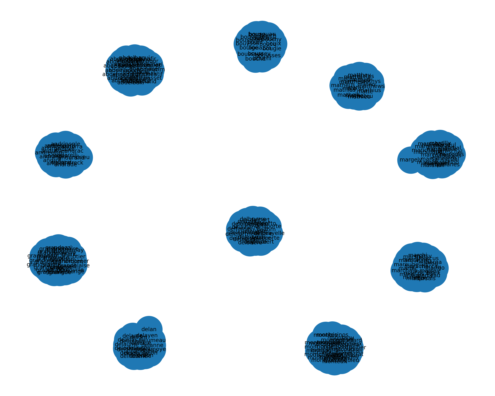
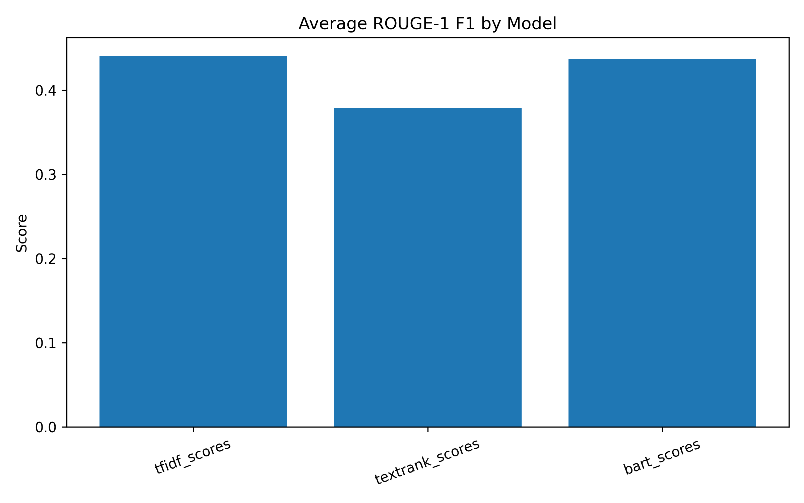
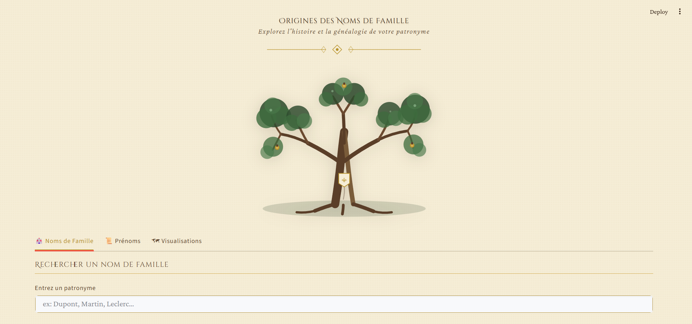
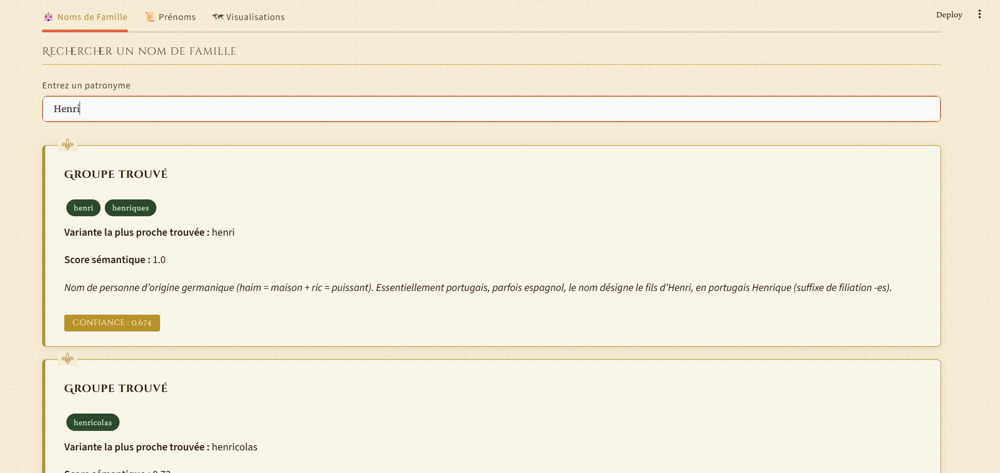
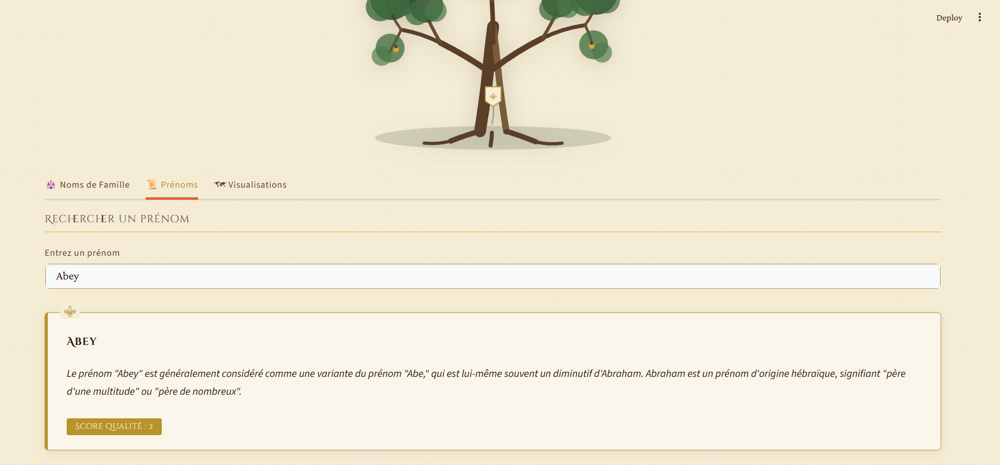
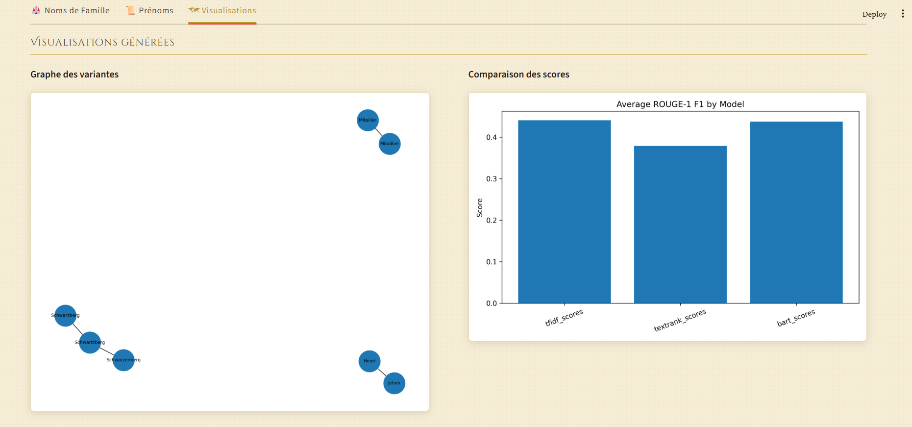
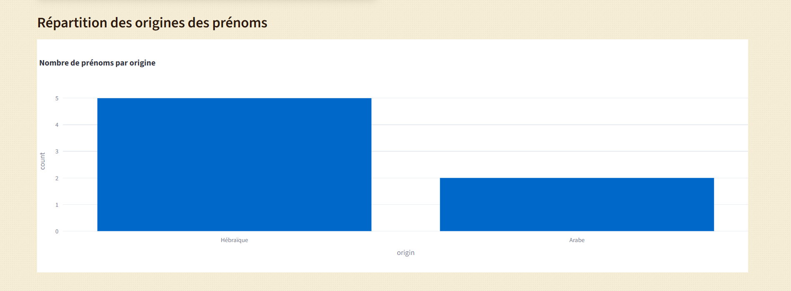

# 🧬 Name Origins NLP Project

### Analyse automatique des origines de noms et prénoms avec NLP

## 📌 Aperçu du projet

Ce projet applique des techniques de **Natural Language Processing (NLP)** pour analyser des noms de famille et prénoms et en extraire automatiquement :

* leurs **origines**
* leurs **significations**
* leurs **variantes**
* des **résumés automatiques**

Le pipeline inclut également :

* la **comparaison de modèles de résumé**
* l’**évaluation des résultats**
* des **visualisations**
* une **application interactive Streamlit**

L’objectif est de construire un **pipeline NLP complet**, allant du traitement des données jusqu’à une interface utilisateur.

---

# 🎯 Objectifs du projet

Ce projet vise à :

* regrouper automatiquement les **variantes de noms**
* générer des **résumés automatiques**
* comparer plusieurs **modèles NLP**
* évaluer la **qualité des résumés**
* extraire les **origines des prénoms**
* visualiser les **relations entre variantes**
* construire une **application interactive**

---

# 🧠 Pipeline NLP

Le projet suit le pipeline suivant :

```
Dataset noms
     ↓
Nettoyage et regroupement des variantes
     ↓
Fusion des groupes
     ↓
Résumé automatique (Transformers)
     ↓
Comparaison des modèles
     ↓
Évaluation
     ↓
Visualisation
     ↓
Application Streamlit
```

---

# 🧩 Structure du projet

```
surname-project
│
├── data
│   └── origins.json
│
├── results
│   ├── merged_groups.json
│   ├── group_summaries.json
│   ├── model_comparison.json
│   ├── evaluation_results.json
│   ├── surname_variant_graph.png
│   ├── model_scores.png
│   ├── firstnames_dataset.json
│   └── firstnames_summaries.json
│
├── src
│   ├── config.py
│   ├── text_grouping.py
│   ├── summarization.py
│   ├── compare_summarizers.py
│   ├── evaluate_summaries.py
│   ├── visualize_variants.py
│   ├── plot_model_scores.py
│   ├── scrape_firstname_list.py
│   ├── scrape_firstname_details.py
│   ├── summarize_firstnames.py
│   └── run_all.py
│
├── app
│   └── streamlit_app.py
│
└── README.md
```

---

# ⚙️ Installation

## 1️⃣ Cloner le projet

```bash
git clone https://github.com/eyabensalem/surname-project
cd name-origins-nlp
```

---

## 2️⃣ Créer un environnement virtuel

```bash
python -m venv venv
```

Activer l'environnement :

Windows :

```
venv\Scripts\activate
```

Linux / Mac :

```
source venv/bin/activate
```

---

## 3️⃣ Installer les dépendances

```
pip install -r requirements.txt
```

---

# 🚀 Exécution du pipeline complet

Le pipeline peut être exécuté avec :

```
python src/run_all.py
```

Ce script exécute automatiquement :

1️⃣ regroupement des variantes
2️⃣ génération des résumés
3️⃣ comparaison des modèles
4️⃣ évaluation
5️⃣ génération des visualisations
6️⃣ scraping des prénoms
7️⃣ résumé des prénoms

Les résultats sont sauvegardés dans :

```
results/
```

---

# 🤖 Modèles NLP utilisés

Le projet utilise des modèles **Transformers (HuggingFace)** pour générer les résumés.

Exemples de modèles testés :

* BART
* T5
* DistilBART

Ces modèles permettent de transformer automatiquement des descriptions longues en résumés courts.

---

# 📊 Visualisations

Deux visualisations principales sont générées.

## Graphe des variantes de noms

Ce graphe montre les relations entre les variantes d’un même nom.


```

```

---

## Comparaison des modèles

Ce graphique compare les performances des différents modèles de résumé.


```

```

---

# 🔎 Extraction des prénoms

Un scraping est réalisé pour récupérer :

* origine
* signification
* description

Puis un résumé automatique est généré.

Exemple :

```json
{
  "first_name": "Abel",
  "origin": "Hébraïque",
  "meaning": "souffle ou vapeur",
  "summary": "Le prénom Abel trouve ses origines dans la Bible et possède des racines hébraïques."
}
```

---

# 🖥 Application interactive

Une application **Streamlit** permet de rechercher :

* un **nom de famille**
* un **prénom**

et d'afficher :

* les variantes
* l'origine
* le résumé
* le score de confiance

---

## Lancer l'application

```
streamlit run app/streamlit_app.py
```

L'application sera disponible sur :

```
http://localhost:8501
```

---

# 📷 Interface de l'application


### Recherche de nom de famille



---

### Recherche de prénom




---

### Visualisations




---

# 📈 Résultats

Le projet permet :

✔ regroupement automatique des variantes
✔ génération de résumés automatiques
✔ extraction d'informations sur les prénoms
✔ comparaison de modèles NLP
✔ visualisation des relations entre noms
✔ application interactive

---

# 🛠 Technologies utilisées

* Python
* HuggingFace Transformers
* Streamlit
* BeautifulSoup
* NetworkX
* Matplotlib
* Requests
* JSON

---

# 🔮 Améliorations possibles

Améliorations possibles du projet :

* ajouter plus de sources de données
* améliorer l'extraction des origines
* utiliser des **embeddings plus avancés**
* ajouter une **recherche fuzzy**
* déployer l'application en ligne

---

# 👩‍💻 Auteur

Eya BEN SALEM
Projet réalisé dans le cadre du **Master Big Data & Intelligence Artificielle**.

---

# ⭐ Remarque

Les résultats dépendent des données disponibles et des modèles utilisés.

Ce projet illustre l'utilisation combinée de :

* **scraping**
* **NLP**
* **visualisation**
* **application interactive**

dans un pipeline complet.

---

